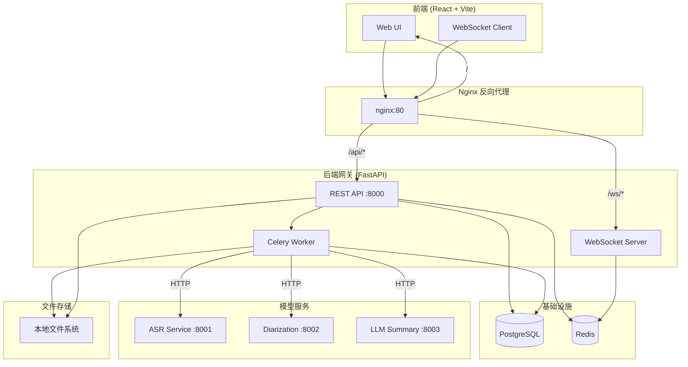
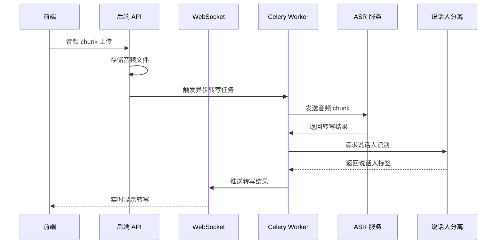
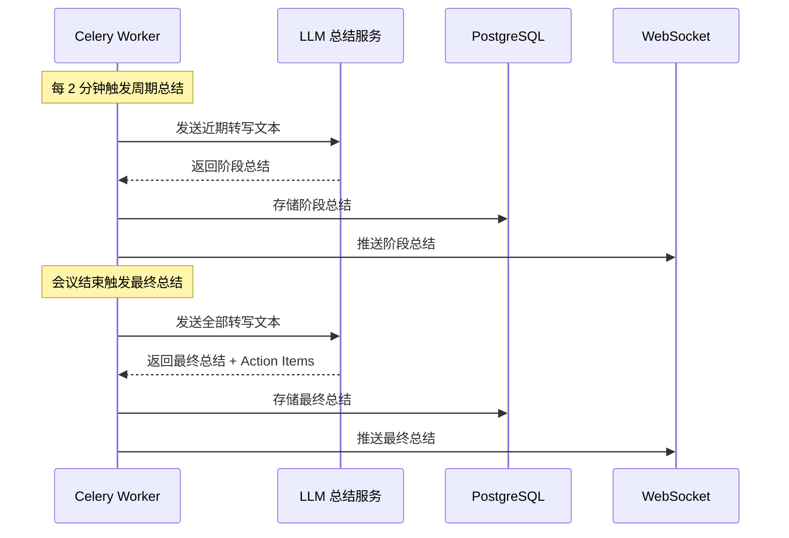

# 系统架构

## 整体架构图

## 数据流

### 实时转写流程

### 会议总结流程

## 部署架构

### 开发环境

全部服务通过 Docker Compose 启动，单机运行，stub 模式。

### 生产环境

建议部署方案：
- Kubernetes 集群部署
- PostgreSQL 主从 + 连接池
- Redis Sentinel / Cluster
- Nginx Ingress Controller
- 模型服务 GPU 节点独立部署
